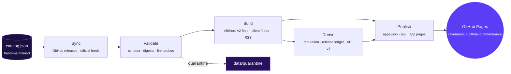

<div align="center">

<a href="https://raynmahbub.github.io/OmniSource/">
  
</a>

<br>
<br>

[](https://raynmahbub.github.io/OmniSource/)
[](https://raynmahbub.github.io/OmniSource/#catalog)
[](https://raynmahbub.github.io/OmniSource/status/)
[](https://raynmahbub.github.io/OmniSource/status/)
[](https://github.com/raynmahbub/OmniSource/actions/workflows/validate.yml)
[](LICENSE)

<br>

<a href="https://raynmahbub.github.io/OmniSource/install/"></a>

<br>

<a href="https://raynmahbub.github.io/OmniSource/install/?add=altstore"></a>
<a href="https://raynmahbub.github.io/OmniSource/install/?add=sidestore"></a>
<a href="https://raynmahbub.github.io/OmniSource/install/?add=feather"></a>
<a href="https://raynmahbub.github.io/OmniSource/install/?add=esign"></a>
<a href="https://raynmahbub.github.io/OmniSource/install/?add=livecontainer"></a>

<br>

**One installable source for AltStore, SideStore, Feather, ESign and LiveContainer —**
**every app resolved from its developer's own upstream, verified on every sync.**

<br>

<!-- omnisource:stats:start -->

**131** apps · **114** upstream sources · **123** verified · **1** community verified · **124/131** downloads online · last sync **2026-10-05**.

<!-- omnisource:stats:end -->

</div>


## The source

```text
https://raynmahbub.github.io/OmniSource/apps.json
```

Paste that into your client's **Add Source** screen. On a phone, the buttons
above open the [install center](https://raynmahbub.github.io/OmniSource/install/) —
one tap, and a QR code when the client is not installed yet.

<br>

## Why OmniSource

<table>
  <tr>
    <td width="33%" valign="top">
      <br>
      <b>Upstream only</b><br>
      <sub>Every entry resolves from the developer's own GitHub releases or official feed. Nothing is re-hosted, nothing is repackaged.</sub>
    </td>
    <td width="33%" valign="top">
      <br>
      <b>Verified on every sync</b><br>
      <sub>Downloads are probed, digests checked where the publisher ships one, and the result is published as a per-app provenance page.</sub>
    </td>
    <td width="33%" valign="top">
      <br>
      <b>One feed, every client</b><br>
      <sub>A deterministic AltStore v2 feed plus tailored feeds for Feather, ESign, Ksign and LiveContainer — the same catalog everywhere.</sub>
    </td>
  </tr>
  <tr>
    <td width="33%" valign="top">
      <br>
      <b>Hands-off by design</b><br>
      <sub>Seventeen GitHub Actions workflows sync, validate, monitor, scan and publish. One hand-maintained <code>catalog.json</code>; everything else is generated.</sub>
    </td>
    <td width="33%" valign="top">
      <br>
      <b>A real API</b><br>
      <sub>Static JSON endpoints (v2 and v3) with gzip twins, a search index, release history, reputation scores and SDKs for JavaScript and Python.</sub>
    </td>
    <td width="33%" valign="top">
      <br>
      <b>The Tweak Factory</b><br>
      <sub>Bring a decrypted base IPA and official tweaks; the pipeline injects them with Cyan and publishes a provenance-tagged release.</sub>
    </td>
  </tr>
</table>

No accounts. No ads. No tracking. No re-hosted binaries.

<br>

## How it works



The full picture — stages, workflows and the data they own — lives in
[`docs/ARCHITECTURE.md`](docs/ARCHITECTURE.md) and the workflow map in
[`.github/workflows/README.md`](.github/workflows/README.md).

<br>

## The website is the documentation

Catalog, app pages with screenshots and release history, per-app hashes and
provenance, source reputation, status and the machine API all live at
**[raynmahbub.github.io/OmniSource](https://raynmahbub.github.io/OmniSource/)**.

<div align="center">

<a href="https://raynmahbub.github.io/OmniSource/#catalog"></a>
<a href="https://raynmahbub.github.io/OmniSource/install/"></a>
<a href="https://raynmahbub.github.io/OmniSource/docs/"></a>
<a href="https://raynmahbub.github.io/OmniSource/api/index.json"></a>

</div>

| Surface | URL |
| :-- | :-- |
| App pages | [`/apps/<slug>/`](https://raynmahbub.github.io/OmniSource/apps/delta/) — screenshots, release history, hashes, provenance |
| Install center | [`/install/`](https://raynmahbub.github.io/OmniSource/install/) — one-tap client links and QR codes |
| Source explorer | [`/sources/`](https://raynmahbub.github.io/OmniSource/sources/) — every upstream with its reputation score |
| Status | [`/status/`](https://raynmahbub.github.io/OmniSource/status/) — download health, last sync, dead links |
| Collections | [`/collections/`](https://raynmahbub.github.io/OmniSource/collections/) — curated shelves (emulators, YouTube, tweaks…) |
| API | [`/api/index.json`](https://raynmahbub.github.io/OmniSource/api/index.json) · [`docs/API.md`](docs/API.md) · [`docs/API-V3.md`](docs/API-V3.md) |
| RSS | [`/feeds/feed.xml`](https://raynmahbub.github.io/OmniSource/feeds/feed.xml) — combined release feed, per-app feeds at `/feeds/<slug>.xml` |

<br>

## For maintainers

```bash
export PYTHONPATH=src                    # stdlib-only, Python 3.11+
python3 -m unittest discover -s tests    # the test suite
python3 scripts/validate.py              # catalog + feed validation
make check                               # the whole gate: lint, tests, reproducibility, smoke
```

`catalog.json` is the only app file you hand-edit — then `make build` (feeds)
and `make derived` (client feeds, API v3, reputation) regenerate the rest.
`scripts/omnisource.py --no-sync --no-health` rebuilds everything offline from
the committed state, and `make check` fails if a generated file drifts.

<details>
<summary><b>Repository map</b></summary>
<br>

| Path | What lives there |
| :-- | :-- |
| `catalog.json` | The hand-maintained catalog — the single source of truth |
| `src/omnisource/` | The pipeline: providers, feeds, validation, site and API builders |
| `scripts/` | CLI entry points, discovery, monitoring, security, reputation, the Tweak Factory |
| `feeds/` | Generated feeds — `apps.json`, per-app JSON/XML, badges, client feeds |
| `api/` | The published static API (v2 + v3) with gzip twins |
| `apps/` · `sources/` · `collections/` | Generated static pages for GitHub Pages |
| `assets/` | Icons, screenshots, brand assets and the Liquid Glass design system |
| `web/` | The Next.js edition of the website (built on CI, promoted manually) |
| `sdk/` | JavaScript and Python clients for the API |
| `tests/` | 600+ unit tests covering the pipeline, feeds, pages and workflows |
| `docs/` | Architecture, operations, API, deployment and the Tweak Factory guide |

</details>

<details>
<summary><b>Design system</b></summary>
<br>

The website ships a zero-dependency **Liquid Glass** design system
(`assets/design-system/`): translucent materials, aurora diffusion, spring
motion and a light/dark/auto theme model. The v3 identity pairs two
materials, exactly like the mark — **chrome silver** for rings, the first
headline line and dividers, and a monochrome **violet aurora**
(`#5b3df5 → #8b5cf6 → #c084fc`) for gradients and glows — set in Inter with
JetBrains Mono for feed URLs, hashes and identifiers.

</details>

Rules in [CONTRIBUTING.md](CONTRIBUTING.md), threat model in
[SECURITY.md](SECURITY.md), the Tweak Factory in
[`docs/TWEAK-FACTORY.md`](docs/TWEAK-FACTORY.md).


<div align="center">

Maintained by **[@raynmahbub](https://github.com/raynmahbub)** · GPL-3.0

<sub>App names, icons and trademarks belong to their owners. OmniSource aggregates metadata and links to public publishers — it does not re-host upstream binaries.</sub>

</div>
