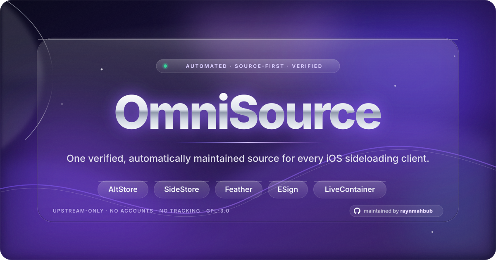
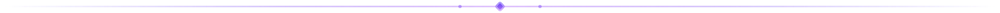

<div align="center">



<br>

[](https://raynmahbub.github.io/OmniSource/)
[](https://raynmahbub.github.io/OmniSource/)
[](https://raynmahbub.github.io/OmniSource/status/)
[](https://github.com/raynmahbub/OmniSource/actions/workflows/validate.yml)
[](LICENSE)

<br>

<a href="https://raynmahbub.github.io/OmniSource/install/"></a>

<br>

<a href="https://raynmahbub.github.io/OmniSource/install/?add=altstore"></a>
<a href="https://raynmahbub.github.io/OmniSource/install/?add=sidestore"></a>
<a href="https://raynmahbub.github.io/OmniSource/install/?add=feather"></a>
<a href="https://raynmahbub.github.io/OmniSource/install/?add=esign"></a>
<a href="https://raynmahbub.github.io/OmniSource/install/?add=livecontainer"></a>

**One installable source for AltStore, SideStore, Feather, ESign and LiveContainer.**

</div>



## Add the source

```text
https://raynmahbub.github.io/OmniSource/apps.json
```

Paste that URL into your client's *Add Source* screen. On an iPhone, the buttons
above open the [installation center](https://raynmahbub.github.io/OmniSource/install/),
which hands off to the client directly and shows a QR code when it is not installed.
GitHub and most chat apps strip client schemes (`altstore://`, `feather://`, …), so
the HTTPS install page is the reliable entry point from anywhere.

## Everything else lives on the website

**→ <https://raynmahbub.github.io/OmniSource/>**

The site is the primary documentation surface: app descriptions, screenshots,
release history, per-app hashes and provenance, source health, install guides and
the API reference. This README deliberately stays short and points there.

<p>
<a href="https://raynmahbub.github.io/OmniSource/"></a>
<a href="https://raynmahbub.github.io/OmniSource/install/"></a>
<a href="https://raynmahbub.github.io/OmniSource/docs/"></a>
<a href="https://raynmahbub.github.io/OmniSource/api/index.json"></a>
<a href="web/"></a>
<a href="CONTRIBUTING.md"></a>
</p>

| Page | What you get |
|---|---|
| [Home · catalog](https://raynmahbub.github.io/OmniSource/) | every app, search, filters, collections, live stats |
| [Install center](https://raynmahbub.github.io/OmniSource/install/) | one-tap add links, QR codes, per-client walkthroughs |
| [App page](https://raynmahbub.github.io/OmniSource/apps/delta/) | description, screenshots, release history, hashes, install |
| [Sources](https://raynmahbub.github.io/OmniSource/sources/) | upstreams, maintainers, cadence, reputation |
| [Status](https://raynmahbub.github.io/OmniSource/status/) | link health, verification, sync and security reports |
| [Docs](https://raynmahbub.github.io/OmniSource/docs/) | architecture, API, operations, deployment |
| [Machine API](https://raynmahbub.github.io/OmniSource/api/index.json) | JSON feeds, versions, gzip twins |

**What is OmniSource?** Every entry is resolved from the app's own official
upstream — GitHub releases, a developer feed, or a project's own releases page —
then validated, hashed where the publisher publishes a digest, probed for
availability, and republished as deterministic AltStore Source v2 feeds. There are
no accounts, ads, reviews, ratings or tracking; the catalog is a hand-maintained
`catalog.json` plus generated feeds, and the automation runs on GitHub Actions.

## Developer quick reference

```bash
export PYTHONPATH=src                      # runtime is stdlib-only, Python 3.11+
python3 -m unittest discover -s tests      # 390 tests
python3 scripts/validate.py                # catalog + feed validation
make check                                 # lint, validate, tests, reproducibility, smoke
```

| Command | Purpose |
|---|---|
| `make build` | sync upstream releases and rebuild every feed, page and API mirror |
| `make derived` | canonical DB, release ledger, enrichment, reputation, client feeds, API v3 |
| `make monitoring` / `make security` | status + self-healing / hash and provenance audit |
| `make serve` | build and serve the static site on `0.0.0.0:8000` |
| `make web` | Next.js app in `web/` — `npm ci`, typecheck, lint, production build |

```text
catalog.json        hand-maintained app/source declarations (the source of truth)
feeds/              generated client feeds, per-app feeds, reports (never edited by hand)
api/                published JSON mirror + gzip twins consumed by clients and the site
src/omnisource/     pipeline, providers, validators, renderers and adapters
scripts/            operational entry points (pipeline, validators, discovery, backup)
web/                Next.js 16 + TypeScript + Tailwind PWA
js/ assets/         zero-dependency GitHub Pages frontend and Liquid Glass design system
docs/               architecture, API, operations and deployment guides
```

Automation: 15 workflows (sync → publish → security → website, plus discovery,
monitoring, analytics, backup, verification and PR gates) documented in
[`.github/workflows/README.md`](.github/workflows/README.md).

## Contributing

Edit `catalog.json`, schemas, source modules or documentation — never the
generated feeds, API copies, app pages or operational snapshots. Run `make check`
before opening a pull request; see [CONTRIBUTING.md](CONTRIBUTING.md) and
[SECURITY.md](SECURITY.md).

## License

GPL-3.0. App names, icons, trademarks and upstream releases belong to their
respective owners; OmniSource aggregates metadata and links to public publishers
and claims no ownership of upstream binaries.
